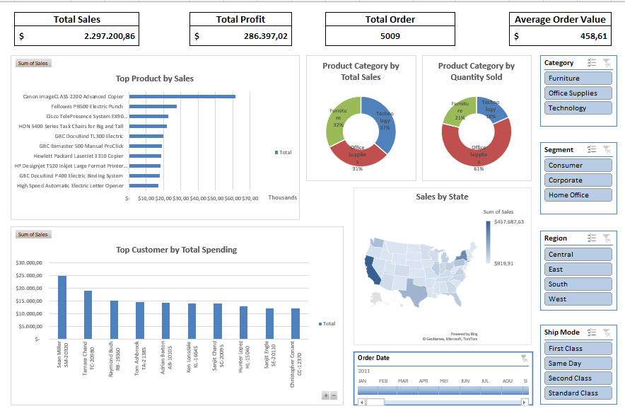

# excel-sales-dashboard-project
Data cleaning, pivot table analysis, and dashboard visualization using Excel dataset from Kaggle
# Excel Sales Data Analysis Project

This project analyzes a sales dataset downloaded from Kaggle.

## Steps Performed
1. Data cleaning in Excel
2. Data transformation
3. Pivot table analysis
4. Dashboard visualization

## Tools Used
- Microsoft Excel
- Pivot Tables
- Data Visualization

## Project Output
Interactive dashboard showing:
- Sales by customer id, product, and product category
- Sales by state
- Monthly trends

## Dashboard Preview

